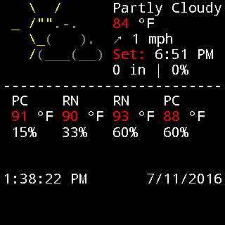

# ASCII Weather Watchface

This watchface shows the weather in an ASCII console-like display.

The weather data is gotten from [forecast.io](forecast.io) and uses your current location
to get the data.

The four rows underneath the weather icon are the predictions for the next four days.

# Building

You must have a file called `credentials.properties` in the root directory which will hold the
following value:
* `API_KEY` Your forecast.io api key. You can use a free key, but keep in mind it only lets you
request data 1000 times a day.

# Acknowledgements

* [schachmat](https://github.com/schachmat) for [wego](https://github.com/schachmat/wego)'s ascii weather icons